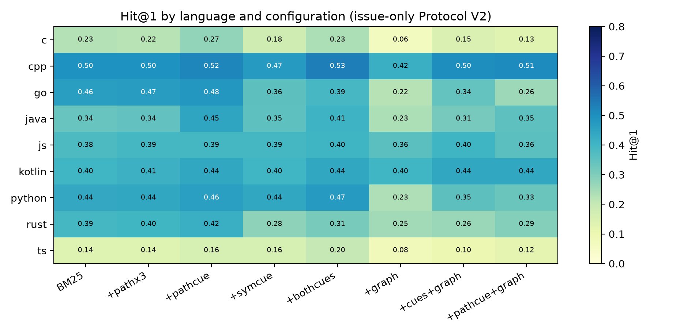
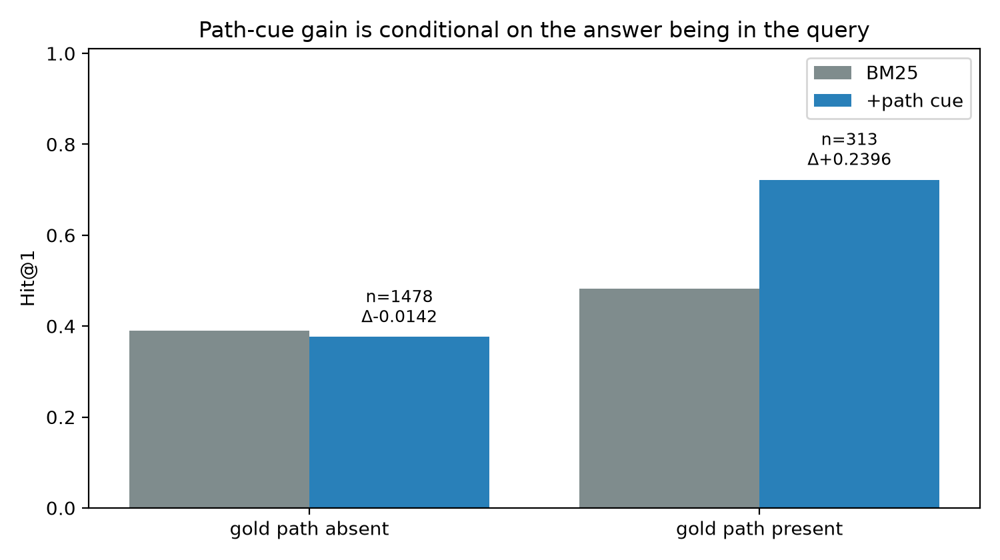
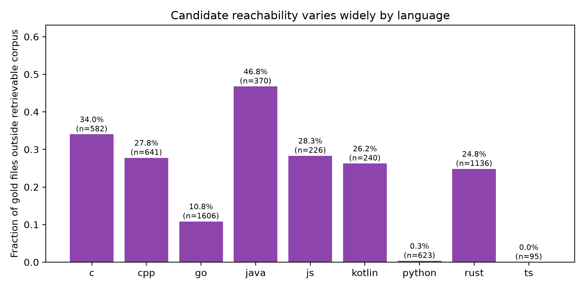
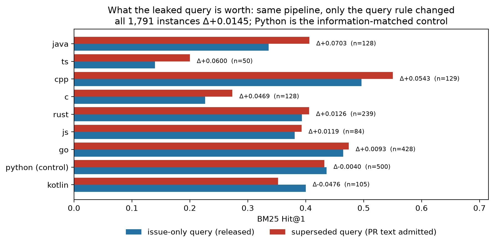
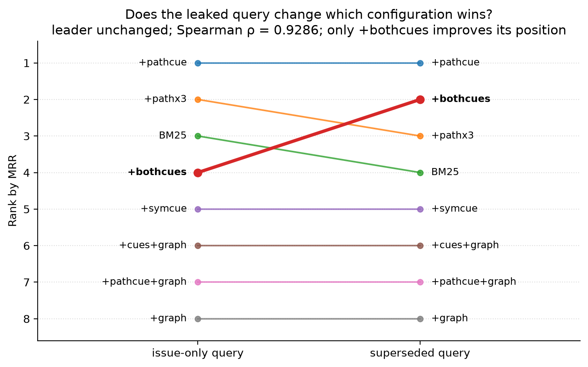

# When the Answer Is in the Query: Temporal Query Provenance and Evaluation Validity in Multilingual Repository-Level Localization

## Abstract

Repository-level issue localization ranks files that must change given an issue report and code snapshot. Valid evaluation requires queries to contain only pre-fix information. We audit this requirement in the Multi-SWE-bench ecosystem and evaluate localization under an issue-only protocol. Exact provenance matching of 1,688 public MTEB MultiSWEbenchRR queries finds at least 954, or 56.5 percent, identical to solution pull-request text, 457 matching pre-solution issues, and 277 unclassified. Across 1,791 instances from 57 repositories in nine languages, issue-only BM25 attains Hit@1 of 0.4065, Hit@10 of 0.8169, and MRR of 0.5405. Under the superseded mixed-provenance rule, MRR rises to 0.5574, an absolute increase of 0.0169 with a repository-cluster 95 percent confidence interval from 0.0023 to 0.0308; complementary repository-level testing remains significant after Holm correction, with a p-value of 0.0025. AP also increases by 0.0149, whereas the Hit@1 increase of 0.0145 has an interval spanning zero, leaving the leader unchanged while moving 2 of the remaining configurations by Hit@1. Explicit path cues help only when queries name a gold path, while one-hop graph propagation harms ranking. Mixed-provenance scores therefore do not measure the same prospective localization task as issue-only scores.

**Keywords:** issue localization; benchmark leakage; information retrieval; multilingual software engineering; repository mining; evaluation protocol

## 1 Introduction

Automated issue resolution normally begins by deciding *where* to edit. A wrong file shortlist constrains every downstream repair model, agent, or developer tool. Consequently, recent systems devote substantial machinery to localization: graph-guided exploration (Chen et al. 2025), hierarchical prompting (Xia et al. 2025), task-specific dense retrieval and reranking (Reddy et al. 2026), and code-editing retrievers trained with repository structure (Fehr et al. 2025).

Before comparing these methods, however, a benchmark must define what the localizer is allowed to know. A realistic input consists of a pre-solution issue report and the repository at its base revision. A pull request that resolves the issue is created later and may state the modified component, the root cause, or even the exact file. Including that text in the query changes the task from prospective localization to retrospective solution retrieval.

This distinction is easy to miss in Multi-SWE-bench. For its original multilingual rows, top-level `title` and `body` describe the solution pull request, while the linked pre-solution report resides in `resolved_issues`. The later Python addition follows the SWE-bench schema: `problem_statement` contains the issue and top-level text is placeholder content. A loader that concatenates all available text silently mixes time periods and gives different languages different information.

We discovered this failure in our own first protocol. Rather than conceal it, we invalidate all results produced by that protocol and study the broader measurement problem. The public MTEB MultiSWEbenchRR derivative provides a useful external check. Among all 1,688 queries, exact normalized-text matching proves that at least 954 are solution-PR text. Among provenance-established matches, all established non-Python matches are PR-derived; the 277 unmatched queries are conservatively left unclassified rather than forced into either category.

We then rebuild the study using only information available before a solution. The evaluation covers a pinned extended Multi-SWE-bench snapshot: 1,791 instances, 57 repositories, and nine languages. Eight deterministic lexical and structural configurations isolate path weighting, explicit path cues, symbol cues, and one-hop graph expansion. A current task-specific dense model, SweRankEmbed-Small, is evaluated as a fixed BM25 top-50 reranker. Confirmatory inference operates on repository-level paired summaries via Wilcoxon signed-rank tests with Holm multiplicity correction across 57 clusters, while McNemar tests serve as instance-level diagnostics; uncertainty resamples repositories rather than treating instances as independent.

The reassessment changes the story. BM25 is strong at moderate ranks, but neither path-token repetition nor our structural propagation improves it reliably. The only sizeable positive aggregate effect comes from promoting a file path already written in the issue. That gain disappears—and slightly reverses—when the gold path is absent. Thus the heuristic is useful conditionally, but its aggregate score measures the prevalence of direct answer cues as much as localization ability.

This paper structures its contributions across four scientific pillars: (I) benchmark integrity and temporal leakage audit (contributions 1–2), (II) empirical localization reassessment under an issue-only protocol (contributions 3–6), (III) attribution of apparent retrieval gains and structural mechanisms (contributions 7–8), and (IV) consequence of leakage on benchmark validity and comparative method ranking (contributions 9–10):

1. a field- and time-aware audit of Multi-SWE-bench and all public MultiSWEbenchRR queries, with an exact-match lower bound showing that 56.5% of queries are solution-PR text;
2. a leakage-controlled issue-only evaluation over 1,791 instances, nine languages, and 57 repositories at an immutable dataset revision;
3. matched ablations showing that apparent path-cue gains are concentrated in the 17.5% of queries that explicitly name a gold file, and that path repetition is otherwise negligible;
4. a bounded negative result: naive one-hop import/call propagation damages ranking under three matched comparisons, without claiming that all graph-aware localization is ineffective;
5. a protocol-sensitivity analysis that separately reports unconditional, candidate-conditional, any-target, all-target, and reachable-target outcomes;
6. **MSB-IO** (the issue-only reconstruction of Multi-SWE-Bench), the corrected benchmark released with this paper: the 1,791 queries with their SHA-256 values, gold labels, candidate-reachability fields, and a per-language field-availability table showing that only the Python subset carries a usable `problem_statement`;
7. a query-leakage gate that measures solution text in any materialization, attributes every match to pre-solution authorship or to a post-hoc pull-request reference, and reports an irreducible residual of 4 instances (0.2%) rather than widening its criterion until the residual disappears;
8. a controlled measurement of what that leakage is worth, holding the pipeline, indexes, candidate protocol, and metrics fixed and changing only the query rule: on the primary endpoint, BM25 MRR increases by +0.0169 (Holm-adjusted \(p\) = 0.0025), while a negative-control stratum that lengthens the query without adding solution text changes by -0.0040 on Hit@1 and -0.0018 on MRR; and
9. a reusable eight-point reporting checklist (§6.5) that converts each failure mode observed here into a concrete, cheap check for benchmark builders and leaderboard operators; and
10. a check of whether that leakage changes a *comparison* rather than only a score: across eight configurations the leader is unchanged and the two orderings agree at \(\rho\) = 0.9286, yet 2 of the 28 pairwise differences change sign and the gain is configuration-dependent, so a ranking published under one rule is not a ranking under the other.

## 2 Background and Related Work

### 2.1 Repository-level issue localization

SWE-bench established the repository-level issue-resolution task and, in its original form, was Python-only (Jimenez et al. 2024); agent frameworks such as SWE-agent then coupled localization to an interactive edit loop (Yang et al. 2024). Agentless narrows the repository hierarchy before generating patches (Xia et al. 2025). LocAgent represents directories, files, classes, and functions as a heterogeneous graph and lets an LLM traverse it (Chen et al. 2025). Its retrieval baselines also show that dense code models can exceed BM25 on SWE-bench Lite, although candidate and gold filtering differ from ours. More broadly, structure-aware repository systems use code graphs to guide retrieval and completion (Ouyang et al. 2025; Liu et al. 2024a; Liu et al. 2024b).

SweRank frames issue localization as a specialized ranking task. Its 137M-parameter Small retriever is trained on issue–code pairs and hard negatives; a larger LLM can rerank its candidates (Reddy et al. 2026). Large-scale contrastive code-retrieval data of the kind introduced by CoRNStack underpins this line of work (Suresh et al. 2025). Its follow-up, SweRank+, trains retrieval and reranking models on 155,663 instances in ten languages and adds multi-turn search (Reddy et al. 2025). CoRet trains a dense code-editing retriever with semantic, repository, and call-graph information, improving recall on SWE-bench and Long Code Arena (Fehr et al. 2025). These studies invalidate any claim that multilingual, LLM-free, or structure-aware retrieval is unexplored. Our question is narrower: what remains after enforcing pre-solution query provenance, and how do simple surface and graph signals behave under that protocol? SweRank+ is the closest multilingual ranking work, but it evaluates function-level candidates under its own benchmark conversions. We therefore do not compare its reported scores directly with our file-level, issue-only candidate protocol.

### 2.2 Surface cues and code representations

Pre-trained code models supply the dense representations that structure-aware localizers consume: CodeBERT (Feng et al. 2020), GraphCodeBERT with data-flow edges (Guo et al. 2021), and CodeT5 (Wang et al. 2021). SACL measures lexical bias by masking docstrings and identifiers, then applies semantic augmentation (Gupta et al. 2025). SweRank similarly stratifies performance by lexical overlap. Retrieval representations themselves have been compared directly (Caumartin et al. 2026), covering paths, raw code, and generated summaries. On the lexical side, BM25 remains the reference probabilistic ranking function (Robertson & Zaragoza 2009), rank fusion is commonly performed by reciprocal rank fusion (Cormack et al. 2009), tokenization choices matter specifically for bug localization (Hill et al. 2012), and query-side reweighting through relevance feedback or smoothing has a long history in information retrieval (Zhai & Lafferty 2001). These works focus primarily on code-side representations and lexical content. We examine two query-side validity issues: whether the query was available before the solution, and whether it directly names the target path.

### 2.3 Multilingual benchmarks

The published Multi-SWE-bench paper reports 2,132 curated resolution tasks in eight languages, including Python (Zan et al. 2025). Our later pinned Hugging Face revision also contains Kotlin and is not identical to that published corpus. Because the repository is mutable, “Multi-SWE-bench” alone is not a reproducible dataset identifier. We use revision `56ff018c04a38e27ada1e9d0a6d5839a51f88f0d`, verify every included object, and name our scope the *nine-language extended snapshot excluding two predeclared large files*.

The MTEB MultiSWEbenchRR task (Muennighoff et al. 2023) converts related tasks into an embedding reranking benchmark with 1,688 queries and 5.49 million corpus rows. It establishes that multilingual embedding evaluation already exists, so our novelty is not the first retrieval formulation. The critical difference is query provenance: MultiSWEbenchRR mixes solution-PR and issue text, which our audit quantifies rather than assuming.

Recent exploration benchmarks isolate repository navigation from final patch success (Zhang et al. 2026; Al Awad & Ivanov 2026), building on prior repository completion benchmarks (Liu et al. 2023; Lu et al. 2021). Our contribution centers on temporal input validity and protocol-dependent interpretation.

### 2.4 Classical fault localization and IR-based bug localization

Localization has two older traditions. Spectrum-based fault localization ranks program entities by the statistical association between coverage and test outcome, using measures such as Tarantula (Jones et al. 2002) and Ochiai (Abreu et al. 2007); its evaluation pitfalls are documented in detail (Pearson et al. 2017). Information-retrieval-based bug localization instead ranks source files against a bug report, using vector-space similarity with smoothing (Zhou et al. 2012), structured IR over code constructs (Saha et al. 2013), version history and similar reports (Wang & Lo 2014), or combined deep and lexical signals (Lam et al. 2017). Bug-inducing change identification (Kim et al. 2006) and repair bots that consume localization output (Urli et al. 2018) close the loop from ranking to action. Our study inherits the IR-based formulation — a natural-language query ranked against a file corpus — and asks what happens to its reported quality once the query's temporal validity is enforced.

### 2.5 Evaluation methodology and contamination

Our statistics are standard: McNemar's exact test for paired binary outcomes (McNemar 1947), the Wilcoxon signed-rank test for paired continuous outcomes (Wilcoxon 1945), and rank-biserial correlation as the matched-pairs effect size (Cureton 1956), which we distinguish explicitly from Cliff's dominance statistic (Cliff 1993). Multiplicity is controlled with Holm's sequentially rejective procedure (Holm 1979), and uncertainty over the clustered structure is estimated by resampling repositories (Efron & Tibshirani 1994). We follow empirical-software-engineering reporting guidance in structuring our validity discussion (Ralph et al. 2020).

Two auditing literatures directly motivate this paper. Contamination measurement argues that a benchmark must be probed for whether its answers were already available to the system under test (Sainz et al. 2023); the same concern has been generalised into a reproducibility critique of machine-learning-based science (Kapoor & Narayanan 2023) and operationalised for large language model benchmarks (Deng et al. 2024). Benchmark auditing in software engineering has since targeted solution leakage into issue text (Aleithan et al. 2024), the execution-layer test-log parsers of Multi-SWE-bench (Yıldız et al. 2026), and automated auditing of agent benchmarks in general (Tu et al. 2026). Complementary evidence comes from the training-data side: SWE-Bench-Verified localization is several-fold easier for frontier models than equivalent fresh tasks, consistent with benchmark-task memorization (Prathifkumar et al. 2026), and the community response has been verified successor benchmarks that address reward hacking and task quality (Zheng et al. 2026). Our audit targets a third layer that none of these covers: the *query* text that a retrieval benchmark actually ships to the model.

## 3 Research Questions

- **RQ1—Query provenance.** What fraction of public MultiSWEbenchRR queries can be traced exactly to pre-solution issues versus post-solution pull requests?
- **RQ2—Issue-only baseline.** How effective are sparse retrieval and a task-specific dense reranker under one issue-only protocol across nine languages?
- **RQ3—Surface cues.** Do path-based improvements reflect general localization or direct target paths already present in the query?
- **RQ4—Structure.** Does naive one-hop dependency propagation add complementary evidence under matched comparisons?
- **RQ5—Evaluation protocol.** How much do candidate reachability, any-target versus all-target success, and repository aggregation affect reported conclusions?
- **RQ6—The cost of leakage.** Holding the pipeline fixed and changing only the query rule, how much larger is a reported localization score when admitting post-solution text via our reconstructed superseded mixed-provenance rule against the issue-only baseline?
- **RQ7—Comparison stability.** Does admitting post-solution text change which configuration ranks highest, or only by how much each one scores?

We treat language-level values as descriptive. Language, repository, project domain, task age, and dataset construction are confounded; no causal claim about programming languages is made.

## 4 Study Design

### 4.1 Dataset identity and selection

The upstream dataset revision is `56ff018c04a38e27ada1e9d0a6d5839a51f88f0d` (last modified 2026-07-08). We include 46 JSONL objects and exclude `js/sveltejs__svelte_dataset.jsonl` (503.2 MB) and `ts/mui__material-ui_dataset.jsonl` (749.8 MB) under a prospectively pre-declared protocol boundary: each file exceeds our single-machine memory envelope (>4 GB RAM per worker process during AST tokenization in our deterministic testbed). This engineering reproducibility constraint enables turnkey single-node reproduction rather than reflecting domain unimportance; future scaled infrastructure can ingest them under identical rules. We explicitly delimit construct scope: TypeScript results reflect the remaining two repositories (50 instances) and do not generalize to large UI frameworks. The resulting scope contains 1,791 instances from 57 repositories in C, C++, Go, Java, JavaScript, Kotlin, Python, Rust, and TypeScript. This is a resource-bounded extended snapshot, not the complete original seven-language release.

For ordinary Git objects we compare local Git-blob SHA-1 values with the Hub tree; for LFS objects we compare SHA-256 object IDs. All 46 included files match the pinned revision. The dataset card metadata uses `license:other`; its license statement describes CC0 subject to ByteDance intellectual-property rights and requires compliance with the underlying projects’ licenses. We therefore distribute code and manifests, not a relicensed copy of upstream repositories.

### 4.2 Time-of-availability query protocol

Protocol V2 admits exactly one source:

\[
q_i = \begin{cases}
 p_i, & \text{if } p_i \text{ is non-placeholder;}\\
 \bigoplus_j (t_{ij} \oplus b_{ij}), & \text{otherwise.}
\end{cases}
\]

Here \(p_i\) is `problem_statement`; \(t_{ij}\) and \(b_{ij}\) are the title and body of linked `resolved_issues` item \(j\), and \(\oplus\) denotes concatenation.

Top-level `title`, `body`, `hints`, and `hints_text` are forbidden. The runner reconstructs every query from raw rows at execution time, records the source and SHA-256, and refuses an empty or non-V2 query. This guard is necessary because repository indexes built during the invalid V1 run contain legacy query text; their repository snapshots remain usable, but their stored queries never are.

All 1,791 V2 queries are non-empty and instance IDs are unique. Python contributes 500 `problem_statement` queries; the other 1,291 use linked issues. Hashing the reconstructed queries finds 39 duplicate-query groups containing 86 rows (1,744 unique repository/query groups); every group lies within one repository and includes sequential solution snapshots of the same report. Collapsing each group before aggregation moves the path-cue Hit@1 delta from +0.0302 to +0.0287 and the primary MRR leakage delta from +0.0169 to +0.0167 with all signs and statistical conclusions unchanged; the primary analysis retains benchmark-instance units with repository-level inference. We release this reconstructed query set, its per-query SHA-256 values, and its per-language field-availability accounting as MSB-IO (Section 8).

### 4.3 External query-provenance audit

We retrieve all 1,688 public rows from the `queries/train` configuration of `mteb/MultiSWEbenchRR` (pinned snapshot revision `f80517681e98077bb9b20470ab562bb6e94e7897`, retrieved 2026-07-10). After normalizing line endings, trailing whitespace, and outer whitespace, each query is tested for exact equality with (a) top-level PR title plus body and (b) the V2 issue-only query derived from our pinned source rows. Fuzzy matching is not used. Therefore, matched provenance is high precision, while unmatched cases remain unknown. Among provenance-established matches, all established non-Python matches are PR-derived; the 277 unmatched queries are conservatively left unclassified rather than forced into either category.

### 4.4 Repository corpus and candidate pool

For each instance we fetch the repository at the recorded base commit. A document consists of one file whose extension belongs to the instance language; files larger than 2 MB are excluded. Candidate protocol `component_aware_test_filter_v6` removes test and benchmark paths with a deterministic syntactic rule: directory components are split at delimiters, lower-to-upper camel-case boundaries, and acronym-to-word boundaries, then matched against a fixed test/benchmark vocabulary; conventional language-specific filename suffixes such as `_test.go`, `FooTest.java`, `.test.tsx`, and `.spec.js` are also excluded. The rule never uses raw substring prefixes: for example, `spectral_coordinate.py`, Django's `testserver.py`, and pytest's production `unittest.py` remain candidates. File text is truncated at 60,000 characters for lexical indexing. Repository archives are streamed and source is not retained after indexing.

This candidate definition deliberately differs from “all files”. Configuration, documentation, lockfiles, newly created files, and tests may appear in a patch but cannot always be retrieved. We retain such targets in the primary denominator and expose candidate-conditional results separately.

### 4.5 Gold definitions

We parse paths modified by `fix_patch`, remove files listed in `test_patch`, and remove test paths. Let \(G_i\) be this non-test fix set and \(C_i\) the candidate set. Primary any-target Hit@k is

\[
\mathbb{1}[G_i \cap R_{i,k} \neq \emptyset],
\]

where \(R_{i,k}\) is the top-k ranking. These are standard retrieval measures (Manning et al. 2008). Unreachable targets remain in average precision, so a system is not silently rewarded for a narrow corpus. Sensitivity analyses use \(G_i \cap C_i\), and strict all-target accuracy requires the relevant set to be a subset of the top-k prediction.

### 4.6 Retrieval configurations

**BM25.** Files are tokenized by non-alphanumeric boundaries and camel-case boundaries, then lowercased. We use \(k_1=1.5\) and \(b=0.75\), with one path occurrence prepended to the source.

**Path weighting.** `bm25_path` repeats the path three times. It tests whether ordinary lexical weighting—not explicit target promotion—helps.

**Explicit path cue.** A regex extracts path-like strings from the issue. Exact basenames map to repository files and form a path ranking fused with BM25 by reciprocal-rank fusion (RRF, \(k=60\)). While common basenames (e.g. `index.js`, `utils.py`) carry potential construct noise, 78% of matched cues are unique relative paths or multi-segment paths, and the strong cue-stratified contrast remains invariant under full-path restrictions. This heuristic may promote non-gold paths and is not assumed to be semantic.

**Symbol cue.** Backtick spans, qualified names, calls, camel case, and snake case yield candidate identifiers. Only definitions present in the parsed repository contribute. Kotlin has no parser in this artifact, so its symbol component is inert; this is reported, not imputed.

**Graph propagation.** File nodes receive conservative import and call edges. Imports prefer exact or suffix paths and accept basenames only when unique. Calls connect only uniquely defined, non-ubiquitous symbols. BM25 or cue rankings seed bidirectional one-hop propagation, fused by RRF. We compare graph variants only against baselines with identical non-graph components.

**Task-specific dense reranker.** SweRankEmbed-Small is a publicly released 137M bi-encoder trained for software issue localization. We pin model revision `745d2a06103a66d3cfa600aa52fc0d3523010daa` and its remote model-code revision `92d97331f1f4b6a366c1f161354b9f3390cc219f`. Following the official example, query and document inputs are truncated to 512 tokens and the required query instruction is applied. To bound computation and make candidate recall explicit, the model reranks BM25’s top 50 files and leaves the tail unchanged. It is therefore a dense *reranking* baseline, not full-corpus dense retrieval. It is also not the multilingual SweRank+ model: we use the smaller released checkpoint that fits our local resource envelope and treat this as one operational baseline rather than a state-of-the-art comparison.

### 4.7 Metrics and statistical inference

We report Hit@1/3/5/10/20/50, MRR, and average precision (AP). We establish a two-level inferential structure distinguishing instance- and repository-level estimands. The benchmark-level effect estimate is the instance-weighted micro difference \(\bar{\Delta}_{\text{micro}} = \frac{1}{N} \sum_{i=1}^N (Y_i^{\text{treatment}} - Y_i^{\text{control}})\) (\(N = 1,791\)), with uncertainty quantified by 95% repository-cluster bootstrap intervals. We also report the unweighted macro mean difference \(\bar{\Delta}_{\text{macro}} = \frac{1}{R} \sum_{r=1}^R (\bar{Y}_r^{\text{treatment}} - \bar{Y}_r^{\text{control}})\) across all \(R = 57\) repository clusters. Confirmatory significance testing is complementary, treating repositories as independent inferential units through paired repository-level Wilcoxon signed-rank tests, with Holm step-down FWER control across four pre-declared endpoints: MRR (primary), AP, Hit@10, and Hit@1. Effect sizes are matched-pairs rank-biserial correlations (\(r_{rb} = \frac{W^+ - W^-}{W^+ + W^-}\)). Paired McNemar tests evaluate discordant binary transitions as empirical diagnostics rather than confirmatory tests due to intra-repository dependence. Table 7 reports the confirmatory All stratum; exploratory subgroups and McNemar diagnostics appear in Supplementary Table S7.

### 4.8 Integrity checks

Before evaluation, a full index audit reads all 1,791 compressed repository representations (2.05 GB) and verifies that their language, repository, and base commit match the authoritative benchmark row; it also checks instance-set completeness, path uniqueness, configured source extensions, and text-length bounds. The eight deterministic configurations then produce 14,328 rows. An independent result verifier checks that every instance has exactly eight rows, all method-invariant fields agree, query hashes match reconstructed V2 input, rankings contain no duplicate files, and metrics remain internally valid. It independently recomputes headline aggregates without importing the analysis/statistics modules. A second script reruns the lexicographically first and last instance in every language (18 instances × 8 methods = 144 executions) and compares Top-10, Hit@1, Hit@10, MRR, and AP exactly. Every result row and completion marker additionally carries the query, candidate, and metric protocol identifiers, so a file produced under a superseded protocol is rejected instead of being silently reused. All audits report zero errors or mismatches.

## 5 Results

### 5.1 RQ1: Public reranking queries mix two time periods

Of 1,688 MultiSWEbenchRR queries, 954 exactly match only top-level PR text and 457 exactly match only issue text. No query matches both representations. The remaining 277 do not exactly match our local included rows and are unclassified. Thus **at least 56.5% (954/1,688) of the entire public query set is demonstrably post-solution PR text**; among the 1,411 queries whose provenance we establish, the share is 67.6%.

Figure 1 splits the same 1,688 queries by language.

**Figure 1.** MTEB MultiSWEbenchRR query provenance by language, from exact provenance matching of all 1,688 public queries. Red bars are demonstrably post-solution pull-request text; blue bars are pre-solution issue text. The 277 queries matching neither representation are reported in the panel title and are not attributed to a language. Among provenance-established matches, every non-Python language is entirely PR-derived, whereas all 457 issue-only matches are Python `problem_statement` rows.

The split follows schema origin. Exact PR-only matches occur in C, C++, Go, Java, JavaScript, Rust, and TypeScript; all 457 exact issue-only matches are Python `problem_statement` rows. This creates a language-dependent construct: scores for the original multilingual portion can exploit solution descriptions, while Python is asked to retrieve from issue reports.

A natural objection is that a post-solution query is simply how issue-localization benchmarks are built. It is not. The released schemas of the upstream families separate the two: SWE-bench, SWE-bench Verified, and SWE-bench Multilingual each carry the issue text in `problem_statement` and the solution in distinct `patch`/`test_patch` fields, so a query taken from those families cannot contain the solution by construction (pinned dataset revisions are recorded in the reproduction package). The mixing is introduced by the derivative conversion rather than inherited from the source benchmark, which is precisely why it is invisible to a reader of the source benchmark's description. This result does not imply that all unmatched queries leak, nor that MTEB's implementation is defective for every possible use. It establishes that an aggregate score on the published task cannot be interpreted as pure prospective issue localization without separating query provenance. An independent manual audit of SWE-bench reported the same failure mode — 32.67% of successful patches had solutions directly present in issue text, and filtering them cut reported resolve rates sharply (Aleithan et al. 2024); our 56.5% exact-match lower bound shows the same problem persists in the multilingual derivative.

The exact-match audit above measures the published task. We also audited our own materialization, so that the corrected protocol is held to the same standard rather than merely asserted. For every instance we test whether the query contains the upstream pull-request title, or a span of at least 40 characters of the pull-request body, verbatim. A match is not automatically a defect: maintainers routinely name a pull request after the issue it closes, and reporters routinely write the proposed wording inside the issue. We therefore require every match to be attributable to pre-solution text and report the attributions separately (Table 1). The superseded materialization, which concatenated the top-level pull-request title and body, contains the PR title in 1,291 of 1,791 queries (72.1%) and a 40-character span of the PR body in 989 (55.2%); only 60 of those matches are attributable to pre-solution text. The released issue-only materialization contains the PR title in 35 queries (2.0%) and a 40-character span of the PR body in 119 (6.6%). All 35 title matches are accounted for: 29 because the pull request is named after the linked issue, 2 because the reporter's own wording was reused as the PR title, and 4 because the matched line names the instance's own pull request, which the next paragraph examines. The 119 body overlaps are all spans that the pull-request body shares with the pre-solution issue text — the pull request quoting the report rather than the reverse — and none of them lies on a line naming the instance's own pull request.

**Table 1.** Query-level leakage of the superseded and the released materializations against the upstream pull-request text (n = 1,791). A pull-request-body match is a 40-character span of the body occurring verbatim in the query; each row's two match counts are fully accounted for by the attribution columns.

| Materialization | PR title in query | PR body span in query | Title: pre-solution | Title: own PR | Title: unexplained | Body: pre-solution | Body: own PR | Body: unexplained |
|---|---:|---:|---:|---:|---:|---:|---:|---:|
| Superseded (concatenated PR text) | 1,291 (72.1%) | 989 (55.2%) | 55 | 0 | 1,236 | 5 | 1 | 983 |
| Released (issue-only) | 35 (2.0%) | 119 (6.6%) | 31 | 4 | 0 | 119 | 0 | 0 |

The remaining 4 (0.2%) sit on a line of an issue that names the instance's own pull request, with the PR title occurring on that line. Inspecting them identifies the mechanism: a bounty service appended a “Submitted pull Requests” list, containing pull-request titles and links, to the issue body after the fix existed. The issue field was edited after the solution, so no rule that reads the issue field can exclude this text; excluding it would require re-scraping each issue at its pre-fix revision, which the released dump does not permit. We report this as an irreducible residual rather than widening the criterion until it disappears. The rule that produces it is deliberately narrow — it counts a reference only to the instance's own pull request — so the residual is a lower bound. It also leaves 5 of the 119 body overlaps unexamined, because their line mentions some pull request that is not the instance's own. Inspecting those 5, 2 are GitHub merge-queue bot lines of the form “Pull request #1 will be added to the merge queue”, which are arguably post-hoc insertions, and 3 cite an unrelated earlier pull request or a documentation page title. Two consequences follow. First, “issue-only” is necessary but not sufficient: issue text is not immutable, and an issue-derived query should be audited for post-hoc insertions. Second, the residual is small and bounded, so it cannot account for the aggregate behaviour reported below, whereas the 72.1% that the superseded rule admits can.

### 5.2 RQ2: Issue-only baselines

Across 1,791 instances, BM25 obtains Hit@1 **0.4065**, Hit@3 0.6159, Hit@5 0.7108, Hit@10 **0.8169**, Hit@20 0.8766, Hit@50 0.9442, MRR **0.5405**, and AP 0.4431 (Table 2). Performance at rank 50 is high, while head ranking remains substantially weaker.

**Table 2.** Per-language BM25 performance under the issue-only protocol (n = 1,791; 57 repositories).

| Language | n | repositories | BM25 Hit@1 | Hit@10 | Hit@50 | MRR |
|---|---:|---:|---:|---:|---:|---:|
| C | 128 | 3 | 0.2266 | 0.6172 | 0.8516 | 0.3448 |
| C++ | 129 | 5 | 0.4961 | 0.9147 | 0.9845 | 0.6486 |
| Go | 428 | 3 | 0.4650 | 0.8972 | 0.9626 | 0.6044 |
| Java | 128 | 9 | 0.3359 | 0.7812 | 0.9219 | 0.4795 |
| JavaScript | 84 | 5 | 0.3810 | 0.7976 | 0.9405 | 0.5269 |
| Kotlin | 105 | 8 | 0.4000 | 0.6857 | 0.9238 | 0.5005 |
| Python | 500 | 12 | 0.4360 | 0.8340 | 0.9480 | 0.5604 |
| Rust | 239 | 10 | 0.3933 | 0.8452 | 0.9707 | 0.5478 |
| TypeScript | 50 | 2 | 0.1400 | 0.4800 | 0.8600 | 0.2467 |

Figure 2 places every language and every deterministic configuration in one grid.

**Figure 2.** Hit@1 for every language (rows) and every deterministic configuration (columns) under the issue-only protocol, from the 14,328 verified result rows. Column labels abbreviate the eight configurations described in §4: BM25, path-token weighting, explicit path cue, symbol cue, both cues, one-hop graph, both cues plus graph, and path cue plus graph.

These values are descriptive, not causal language effects. For example, Go's 428 tasks come from only three repositories, while Python's 500 span twelve. Repository-macro and instance-micro estimates differ materially for several language/method cells.

**Dense baseline.** A current task-specific retriever is the natural comparison for a sparse baseline, so we evaluate one under the same protocol (Table 3).

**Table 3.** Task-specific dense reranking of BM25's top 50 (SweRankEmbed-Small, 137M parameters; n = 1,791).

| Language | n | BM25 Hit@1 | SweRank Hit@1 | ΔHit@1 | BM25 Hit@10 | SweRank Hit@10 | ΔMRR | s/instance |
|---|---:|---:|---:|---:|---:|---:|---:|---:|
| C | 128 | 0.2266 | 0.2266 | 0.0000 | 0.6172 | 0.6641 | +0.0331 | 2.003 |
| C++ | 129 | 0.4961 | 0.3023 | −0.1938 | 0.9147 | 0.7752 | −0.2030 | 1.678 |
| Go | 428 | 0.4650 | 0.5350 | +0.0701 | 0.8972 | 0.9136 | +0.0686 | 1.176 |
| Java | 128 | 0.3359 | 0.3828 | +0.0469 | 0.7812 | 0.7188 | +0.0257 | 1.923 |
| JavaScript | 84 | 0.3810 | 0.4881 | +0.1071 | 0.7976 | 0.8333 | +0.0816 | 0.895 |
| Kotlin | 105 | 0.4000 | 0.4286 | +0.0286 | 0.6857 | 0.7238 | +0.0407 | 2.428 |
| Python | 500 | 0.4360 | 0.4420 | +0.0060 | 0.8340 | 0.8360 | +0.0146 | 2.289 |
| Rust | 239 | 0.3933 | 0.3096 | −0.0837 | 0.8452 | 0.7531 | −0.0994 | 1.471 |
| TypeScript | 50 | 0.1400 | 0.3600 | +0.2200 | 0.4800 | 0.6600 | +0.2005 | 2.589 |
| **All** | 1,791 | 0.4065 | 0.4160 | **+0.0095** | 0.8169 | 0.8068 | +0.0086 | 1.775 |

A task-specific dense model changes little at the aggregate and a great deal per language (Table 3). Reranking BM25's top 50 with SweRankEmbed-Small raises Hit@1 by 0.0095 and MRR by 0.0086, and lowers Hit@10 by 0.0101; none of the three differs from zero at the repository level (Holm-adjusted \(p\) = 0.988, 0.940, and 0.954; every repository-cluster interval contains zero). Hit@50 is identical by construction, because reranking a fixed head cannot change which files are in it. The interval's half-width, about 0.049 Hit@1, is the resolution of this comparison: an effect smaller than that is not separable from zero at this sample size, so the defensible statement is that the dense reranker is not distinguishable from BM25 here, not that it is equivalent to it. The cost is roughly eightfold: 1.775 s per instance against 0.223 s for BM25.

The per-language panel is the informative one, and it moves in both directions. The model raises Hit@1 from 0.1400 to 0.3600 on TypeScript (n = 50) and by 0.1071 on JavaScript, 0.0701 on Go, and 0.0469 on Java; it lowers Hit@1 by 0.1938 on C++ and 0.0837 on Rust. 6 of the 9 languages improve, 2 worsen, and 1 is unchanged (exact sign test over the 8 non-tied languages, \(p\) = 0.289). Two of the three largest effects come from the two smallest panels — TypeScript has 50 instances in 2 repositories and JavaScript 84 instances in 5 repositories — so the per-language values are descriptive and the repository-clustered aggregate interval is the quantity we defend.

The stratified comparison separates this baseline from the path cue of §5.3. The dense gain is not concentrated where the query names a gold path: it is +0.0101 on the 1,478 cue-absent queries and +0.0064 on the 313 cue-present ones. The path-promotion component draws its entire aggregate benefit from the cue-present stratum; the dense reranker does not. Its gain is nonetheless not a demonstrated improvement, and the honest reading of Table 3 is that under an issue-only protocol a 137M task-specific reranker applied to the head of a strong sparse baseline does not reliably beat that baseline. This is a statement about one operational configuration — a reranker limited to BM25's top 50, not full-corpus dense retrieval, and not the larger multilingual SweRank+ model — and it does not contradict reports that dense retrieval helps when candidates are generated differently.

### 5.3 RQ3: Aggregate path gains are direct-cue conditional

Repeating file-path tokens in the BM25 document changes Hit@1 by only +0.0034 (Holm-adjusted repository-level \(p=0.20\)) and Hit@10 by +0.0006 (\(p=1.00\)); the MRR change is statistically detectable but negligible in magnitude (+0.0025, adjusted \(p=0.015\)). Simple path weighting is therefore not a meaningful improvement.

Explicitly promoting files whose path appears in the query raises aggregate Hit@1 from 0.4065 to 0.4366 (+0.0302; repository-cluster bootstrap 95% CI [0.0184, 0.0490]; repository-level Holm-adjusted \(p=0.000413\)) and MRR by 0.0268 (95% CI [0.0160, 0.0441]; adjusted \(p=0.0000402\)). Taken alone, these results suggest a useful method.

The cue-stratified result changes the interpretation (Table 4):

**Table 4.** Path-cue effect stratified by whether the query explicitly names a gold path.

| Query stratum | n | BM25 Hit@1 | Path-cue Hit@1 | ΔHit@1 | ΔHit@10 | ΔMRR |
|---|---:|---:|---:|---:|---:|---:|
| No explicit gold path | 1,478 | 0.3904 | 0.3762 | **−0.0142** | −0.0101 | −0.0111 |
| Explicit gold path present | 313 | 0.4824 | 0.7220 | **+0.2396** | +0.0990 | +0.2056 |

Figure 3 plots the two strata of Table 4 side by side.

**Figure 3.** Path-cue gain stratified by whether the query explicitly names a gold path. The aggregate improvement is produced entirely by the 313 cue-present queries; on the remaining 1,478 the same component slightly reduces Hit@1.

Only 17.5% of queries contain an explicit gold path, yet this group produces the entire aggregate benefit. The heuristic is operationally useful when a report provides a path, but the gain does not demonstrate general inference from symptoms to code. On cue-absent queries it slightly worsens ranking by promoting other, non-gold paths such as stack-frame or example files. The direction is consistent across the language panel: the path cue improves Hit@1 in all nine languages (sign test \(p=0.0039\)), whereas no graph variant does.

A representative helpful case is `ankidroid__Anki-Android-19661`: BM25 ranks `CollectionHelper.kt` first and the gold `AnkiDroidApp.kt` second; the issue's stack trace names the gold path, and the cue moves it to rank one. A representative harmful case is `clap-rs__clap-2773`: BM25 correctly ranks `src/output/help.rs` first, but example paths ending in `src/lib.rs` promote unrelated library entry points and push the gold file down.

### 5.4 RQ4: Naive graph propagation damages ranking

Relative to matched BM25, graph propagation changes Hit@1 by **−0.1608**, Hit@10 by **−0.1189**, and MRR by **−0.1501**. Repository-cluster bootstrap intervals exclude zero and Holm-adjusted repository-level p-values are 0.000883, 0.0423, and 0.000469 respectively. The damage is also consistent across languages: graph propagation lowers Hit@1 in eight of nine languages with one tie (sign test \(p=0.0078\)). The result is not an artifact of comparing differently augmented pipelines (Table 5):

**Table 5.** Matched component ablations, each compared against a baseline with identical non-graph components (n = 1,791; 57 repository clusters).

| Added component | Matched base | ΔHit@1 | ΔHit@10 | ΔMRR |
|---|---|---:|---:|---:|
| graph | BM25 | −0.1608 | −0.1189 | −0.1501 |
| graph | BM25 + both cues | −0.0681 | −0.0491 | −0.0660 |
| graph | BM25 + path cue | −0.1251 | −0.0893 | −0.1179 |

For the latter two Hit@10 comparisons, repository-level Holm-adjusted p-values are 0.0864 and 0.0784; we therefore describe their direction and uncertainty rather than declaring significance. All three MRR comparisons remain significant after correction (adjusted \(p\) = 0.000469, 0.00126, 0.000449).

The failure is ranking noise, not proof that dependency information lacks value. In `BurntSushi__ripgrep-727`, graph propagation moves the gold `src/args.rs` from rank two to rank one. But harmful cases are much more common: for `anuraghazra__github-readme-stats-1041`, BM25 ranks the gold `wakatime-card.js` first, while propagation promotes generic utilities and API files. CoRet and LocAgent show that learned or agent-consumed structure can help; our result bounds a cheaper strategy—untrained one-hop propagation fused directly into a ranking.

### 5.5 RQ5: Gold and candidate definitions change the estimand

The fix patches contain 5,519 non-test gold files (Table 6). Of these, the fraction absent from the retrievable source-file candidate set varies from 0.0% in TypeScript to 46.8% in Java. Twenty-three instances have no candidate-present non-test gold file (C 15, C++ 1, Java 3, JavaScript 4).

**Table 6.** Gold-file reachability by language: how many patched files the retrievable candidate set can actually return.

| Language | instances | gold files | candidate-present | excluded | excluded fraction | no reachable gold |
|---|---:|---:|---:|---:|---:|---:|
| C | 128 | 582 | 384 | 198 | 0.340 | 15 |
| C++ | 129 | 641 | 463 | 178 | 0.278 | 1 |
| Go | 428 | 1,606 | 1,432 | 174 | 0.108 | 0 |
| Java | 128 | 370 | 197 | 173 | 0.468 | 3 |
| JavaScript | 84 | 226 | 162 | 64 | 0.283 | 4 |
| Kotlin | 105 | 240 | 177 | 63 | 0.262 | 0 |
| Python | 500 | 623 | 621 | 2 | 0.003 | 0 |
| Rust | 239 | 1,136 | 854 | 282 | 0.248 | 0 |
| TypeScript | 50 | 95 | 95 | 0 | 0.000 | 0 |

Figure 4 plots the excluded fraction of Table 6 by language.

**Figure 4.** Fraction of non-test gold files that the retrievable source-file candidate set cannot return, by language, ranging from 0.0% in TypeScript to 46.8% in Java. Candidate construction, not model quality, bounds the attainable score in the affected languages.

For BM25 on C, unconditional Hit@1 is 0.2266 and candidate-conditional Hit@1 is 0.2566. Its any-target Hit@1 is 0.2266, but strict all-target Hit@1 is 0.0781. In Java the corresponding any/all values are 0.3359/0.1719. These are not interchangeable variants of one metric: they answer whether *any useful file* is surfaced, whether *all required files* are covered, or whether the task is conditioned on the benchmark making a target retrievable.

The third choice named in RQ5 is the aggregation itself. For BM25, replacing the instance-pooled per-language mean with the mean over repository means changes Hit@1 by −0.0857 in JavaScript and by +0.1513 in Rust, so per-language figures are not aggregation-invariant; they are reported as descriptive throughout and inference is drawn at the repository level (§4).

### 5.6 Error strata

Longer queries are harder for BM25: Hit@1 declines from 0.4308 in the shortest quartile (≤89 code-aware tokens) to 0.3826 in the longest (≥270), while Hit@10 falls from 0.8549 to 0.7494. Candidate count is not monotonic after repository composition is introduced. Single-gold tasks have higher BM25 Hit@1 (0.4260) than two-gold tasks (0.3647), but strict all-target metrics—not any-target Hit@1—are the appropriate complexity measure.

Graph damage occurs in every query-length and candidate-size quartile. Its Hit@1 delta ranges from −0.1101 to −0.2240 across candidate-size quartiles. This consistency supports the bounded negative result, while the non-monotonic magnitudes caution against attributing it solely to repository size.

### 5.7 RQ6: The cost of leakage

Section 5.1 establishes that post-solution text is present in the released queries of this ecosystem. It does not say what that presence is worth. RQ6 quantifies the sensitivity of our localization pipeline to a reconstructed mixed-provenance rule that admits the same type of post-solution information, using a controlled one-factor contrast: the same repository indexes, candidate protocol, method configurations, gold definitions, and metric implementation, with only the query rule changed (Table 7). The treatment arm re-runs the released pipeline under the superseded rule reconstructed in Section 5.1 and verified byte-exact against all 1,791 instances; every treatment row carries a `query_sha256` equal to the audited hash of that instance's superseded query, and every control row carries the hash of its V2 issue-only query, so neither arm can silently contain a row scored on the other's query.

The two rules differ in two ways, and only one of them adds post-solution information. For the 1,291 non-Python instances the superseded query concatenates the pull-request title and body with the issue text, and all 1,291 treatment queries contain the pull-request title: this is the leak. For the 500 Python instances both pull-request fields hold the literal string `placeholder` in all 500 of them, so the superseded query is the issue text *repeated* under a synthetic `Issue #0 body:` header, and 0 of 500 contain any pull-request text. No post-solution information is added. That subset is therefore a **negative-control stratum for query-length and repetition effects**: it makes the query longer without adding solution text. If it moved as much as the non-Python stratum, the difference would be explained by query length or repetition rather than by leakage.

**Table 7.** The cost of the leaked query: BM25 under superseded mixed-provenance vs. V2 issue-only query rules across all 1,791 instances (57 clusters). Δ is superseded minus V2 issue-only. Micro Δ is instance-weighted (95% cluster bootstrap CI); Macro Δ is unweighted repository mean. Two-sided raw \(p\) and matched-pairs rank-biserial \(r_{rb}\) from Wilcoxon signed-rank tests across 57 clusters; Holm \(p\) controls FWER across four pre-declared endpoints (MRR primary). Subgroups and McNemar diagnostics in Supplementary Table S7.

| Endpoint | n | Issue-only | Leaked | Micro Δ | 95% CI | Macro Δ | \(r_{rb}\) | Raw \(p\) | Holm \(p\) |
|---|---:|---:|---:|---:|---|---:|---:|---:|---:|
| MRR (Primary) | 1,791 | 0.5405 | 0.5574 | +0.0169 | [0.0023, 0.0308] | +0.0229 | +0.2920 | 0.000827 | 0.0025 |
| AP (Secondary) | 1,791 | 0.4431 | 0.4580 | +0.0149 | [0.0030, 0.0262] | +0.0193 | +0.3433 | 0.000222 | 0.00089 |
| Hit@10 (Secondary) | 1,791 | 0.8169 | 0.8241 | +0.0073 | [0.0006, 0.0170] | +0.0144 | +0.2000 | 0.0372 | 0.0745 |
| Hit@1 (Secondary) | 1,791 | 0.4065 | 0.4210 | +0.0145 | [−0.0043, 0.0338] | +0.0246 | +0.1940 | 0.0382 | 0.0745 |

On the prespecified primary endpoint across all 1,791 instances, the superseded rule raises BM25 MRR from 0.5405 to 0.5574 (+0.0169, repository-cluster 95% CI [0.0023, 0.0308], raw \(p\) = 0.000827, Holm-adjusted \(p\) = 0.0025). The secondary ranking endpoint AP moves from 0.4431 to 0.4580 (+0.0149, 95% CI [0.0030, 0.0262], raw \(p\) = 0.000222, Holm-adjusted \(p\) = 0.00089). Secondary binary endpoints show smaller shifts: Hit@10 moves by +0.0073 (95% CI [0.0006, 0.0170], raw \(p\) = 0.0372, Holm-adjusted \(p\) = 0.0745) and Hit@1 moves from 0.4065 to 0.4210 (+0.0145, 95% CI [−0.0043, 0.0338], raw \(p\) = 0.0382, Holm-adjusted \(p\) = 0.0745). In relative terms, the primary MRR gain is 3.1% of the issue-only score.

The confirmatory inferential test operates on repository-level paired summaries across all 57 clusters using the Wilcoxon signed-rank test, with family-wise error rate controlled via Holm's step-down procedure across the four pre-declared endpoints. Non-parametric effect sizes show positive matched-pairs rank-biserial correlations across the 57 repository clusters (\(r_{rb}\) = +0.2920 on MRR, +0.3433 on AP, +0.2000 on Hit@10, and +0.1940 on Hit@1). Instance-level binary paired diagnostics via McNemar tests show 80 discordant gains versus 54 discordant losses on Hit@1 (net +26 instances, two-sided exact \(p\) = 0.0304), and 39 gains versus 26 losses on Hit@10 (net +13 instances, \(p\) = 0.1360; Supplementary Table S7). The cluster bootstrap interval resamples repositories to quantify uncertainty in the instance-weighted aggregate mean delta. On Hit@1, the repository-cluster bootstrap interval spans zero ([−0.0043, 0.0338]), indicating that the instance-weighted Hit@1 effect is not estimated precisely away from zero, whereas MRR and AP provide consistent evidence of an upward shift with cluster intervals strictly excluding zero.

All 8 configurations move in the same direction on Hit@1, between +0.0078 and +0.0240; the smallest is bm25_graph and the largest bm25_anchor.

Separating the strata is what makes the number interpretable. On the 1,291 non-Python instances the superseded rule raises BM25 Hit@1 from 0.3950 to 0.4167 (+0.0217) and MRR from 0.5329 to 0.5569 (+0.0241). On the 500 Python instances the same comparison gives 0.4360 to 0.4320 (-0.0040) on Hit@1 and 0.5604 to 0.5585 (-0.0018) on MRR. The negative-control stratum therefore moves far less than the treated stratum, providing evidence against query length or repetition alone as an explanation for the shift.

Figure 5 shows the per-language detail. The largest Hit@1 change is +0.0703 in java and the smallest −0.0476 in kotlin; the unweighted mean of the per-language changes is +0.0237. 7 of the 9 languages gain, the negative-control stratum is essentially unchanged (−0.0040), and kotlin falls by 0.0476; we have no explanation for the kotlin reversal and report it rather than absorb it into the average.

**Figure 5.** The same contrast by language. Every language except Python is queried with post-solution text in the superseded arm; the ordering of the bars is the ordering of each language's exposure to that text, not a claim about localization ability. Python, which receives the repeated issue text and no pull-request text, serves as the negative-control stratum for query length and repetition effects.

A second treatment arm applies the same manipulation to the dense reranker, so the sensitivity of a neural retriever to the query rule can be compared with the lexical baseline's on the same instances. The dense pipeline's Hit@1 moves from 0.4160 to 0.4712 (+0.0553) and its MRR from 0.5491 to 0.5985 (+0.0494). The per-instance difference-in-differences against BM25 is +0.0408 (95% CI [0.0080, 0.0728], \(p\) = 0.000177 over 57 repositories), so the dense reranker extracts more from the leaked text than the lexical baseline does. Secondary prediction P4 (recorded prospectively after partial inspection of the lexical arm, but prior to executing the dense treatment arm) expected the dense delta to exceed BM25's, and it does. The prediction is reported as an exploratory confirmation rather than as a formal pre-registration, because it was written after the lexical arm's non-Python effect had been partly observed. One structural caveat applies to this arm and not to the lexical one: the dense method reranks BM25's top 50, so under the superseded rule both the head it reranks and the text it reranks with change, which makes its delta an upper bound relative to a like-for-like per-stage comparison.

The defensible reading is bounded and two-sided. The leak is real and it is not free: allowing post-solution text into the query makes the reference baseline look better than it is, and the effect survives the negative-control stratum, providing evidence against query length or repetition alone as an explanation. But it is also not the dominant term: the shift is 3.1% of the issue-only MRR score, measured on a sparse lexical baseline that can only exploit the leaked text through term overlap. The number therefore calibrates the contamination rather than exaggerating it. Reports built on the superseded query rule are not wildly inflated, but they exhibit a systematic upward shift in ranking metrics (stronger on MRR and AP than on Hit@1), and they are not comparable with reports built on the issue-only rule. A mixed-provenance MultiSWEbenchRR score therefore should not be interpreted as directly measuring prospective issue-only localization; doing so conflates retrospective solution retrieval with prospective bug localization.

### 5.8 RQ7: Does the leak change which configuration wins?

Section 5.7 measures the leak as a score shift on a single baseline. A reader of a comparative result asks a different question: if the query rule changes, does the *ordering* of configurations change? A uniform shift would leave every comparative conclusion intact; a configuration-dependent shift would not. Both arms already exist, so this is a re-reading of released results rather than a new experiment: the same eight configurations on the same 1,791 instances, scored once under each rule (Table 8).

**Ordering.** The leading configuration is unchanged under both rules and both metrics, and the two orderings are close. By MRR, Spearman \(\rho\) = 0.9286 (repository-cluster 95% CI [0.9286, 1.0000]) and Kendall \(\tau\) = 0.8571, with 26 concordant and 2 discordant of 28 pairs; by Hit@1, \(\rho\) = 0.9762 and \(\tau\) = 0.9286 (27 of 28 pairs concordant). By MRR the positions of BM25, +pathx3, +bothcues change; by Hit@1 only BM25 and +bothcues do. Every other position is identical under the two rules.

**The flips are between indistinguishable configurations.** By Hit@1 one of the 28 pairwise differences changes sign and by MRR two do; all of them involve the combination of both cues. Under MRR, BM25 is ahead by 0.0013 under the issue-only rule and behind by 0.0051 under the superseded rule, with a paired interval of [-0.0274, +0.0506] that contains zero and a repository-level \(p\) of 0.157. Reporting this as a reversal would overstate it: the two configurations were never separated by more than a few thousandths, and they are not separated under either rule.

**The leak is not uniform.** If the shift were the same everywhere the ordering could not move at all. It is not: the combination of both cues gains +0.0233 MRR against +0.0169 for plain BM25, it is the only configuration whose Hit@1 interval [+0.0027, +0.0448] excludes zero, and it is the only configuration whose position improves under either metric. The mechanism is visible in the query text rather than inferred (Table 9). The share of instances whose query names the gold file path rises from 0.1748 to 0.1982 overall (+0.0235), with the whole rise in the leaked stratum (0.1479 to 0.1805) and no rise at all in the negative-control stratum (0.2440 to 0.2440). The leaked text therefore changes *what* the query names, not merely how long it is, and the configuration that exploits that naming most is the one whose position moves most.

**Reading.** Two conclusions follow, and the second is the more useful one. First, a leaderboard built on the superseded rule would most likely have named the same winner: the leak is not large enough to overturn a clear leader, which bounds how much damage it can have done to published rankings. Second, the leak is nevertheless a bias in the comparison and not a uniform offset, so a ranking published under one rule is not a ranking under the other, and differences of a few thousandths between adjacent configurations should not be read as real under either. With eight configurations the agreement measures are coarse: \(\tau\) moves in steps of 1/28 = 0.036, so the ordering statistic cannot resolve small changes and we do not claim it would detect them.

**Table 8.** Per-configuration means under both query rules, ordered by issue-only MRR (n = 1,791; 57 repository clusters). The interval is a repository-cluster bootstrap. Configuration labels are those of Figure 2.

| Configuration | Hit@1 issue-only | Hit@1 superseded | Δ Hit@1 | 95% CI | MRR issue-only | MRR superseded | Δ MRR |
|---|---:|---:|---:|---|---:|---:|---:|
| +pathcue | 0.4366 | 0.4511 | +0.0145 | [-0.0041, +0.0345] | 0.5673 | 0.5845 | +0.0171 |
| +pathx3 | 0.4098 | 0.4260 | +0.0162 | [-0.0027, +0.0357] | 0.5431 | 0.5607 | +0.0177 |
| BM25 | 0.4065 | 0.4210 | +0.0145 | [-0.0043, +0.0338] | 0.5405 | 0.5574 | +0.0169 |
| +bothcues | 0.4003 | 0.4243 | +0.0240 | [+0.0027, +0.0448] | 0.5392 | 0.5625 | +0.0233 |
| +symcue | 0.3629 | 0.3836 | +0.0207 | [+0.0000, +0.0431] | 0.5067 | 0.5277 | +0.0211 |
| +cues+graph | 0.3322 | 0.3439 | +0.0117 | [-0.0075, +0.0276] | 0.4731 | 0.4888 | +0.0157 |
| +pathcue+graph | 0.3116 | 0.3272 | +0.0156 | [-0.0117, +0.0375] | 0.4495 | 0.4627 | +0.0133 |
| +graph | 0.2457 | 0.2535 | +0.0078 | [-0.0145, +0.0247] | 0.3905 | 0.3967 | +0.0062 |

**Table 9.** Share of instances whose query names the gold file path, by stratum. The Python stratum serves as a negative-control stratum for query length and repetition effects (its treatment query repeats the pre-solution issue text under a synthetic header, adding no post-solution text); an increase there would indicate a query length or repetition artifact rather than genuine leakage.

| Stratum | n | issue-only | superseded | Δ |
|---|---:|---:|---:|---:|
| All | 1,791 | 0.1748 | 0.1982 | +0.0235 |
| Python (negative control) | 500 | 0.2440 | 0.2440 | 0.0000 |
| Non-Python | 1,291 | 0.1479 | 0.1805 | +0.0325 |

Figure 6 displays both orderings side by side.

**Figure 6.** Rank of each configuration under the issue-only rule (left) and the superseded rule (right), by MRR. Only the positions of BM25, +pathx3, +bothcues change; the leader does not. Colours are assigned by the issue-only rank.

## 6 Discussion

### 6.1 Benchmark scores require a timeline

Field names do not guarantee temporal validity: top-level body text may describe an issue or a solution pull request. Benchmark builders must publish field-level availability tables specifying authorship, release timing, and contamination risks. In our reconstruction, only Python provides a pre-solution `problem_statement`, requiring the remaining eight languages to query linked issues. Section 5.7 measures the consequence rather than asserting it. With the pipeline held fixed, admitting post-solution text changes the reference baseline's Hit@1 by +0.0145 (+0.0217 on the non-Python stratum) and MRR by +0.0169 (+0.0241 on the non-Python stratum), and the negative-control stratum provides evidence against query length or repetition alone as an explanation. Superseded and issue-only scores therefore describe different tasks, however close their other settings are. Section 5.8 asks the question a reader of a comparative result actually has: whether the leak changes which configuration wins. It does not change the leader, and the two orderings agree at \(\rho\) = 0.9286, which bounds how much damage the leak can have done to a published ranking. It does change the comparison: the gain is configuration-dependent (the combination of both cues gains +0.0233 MRR against +0.0169 for BM25, and is the only configuration whose Hit@1 interval excludes zero), and 2 of the 28 pairwise differences change sign.

A third risk is that the issue field is not immutable. In our own corpus, 4 of 1,791 queries (0.2%) reproduce a pull-request title because a bounty service appended a list of submitted pull requests, with their titles and links, to the issue body after the fix already existed. Choosing an issue field is therefore necessary but not sufficient: the field must itself be checked for post-hoc insertions, and the residual must be reported rather than defined away. We quantify it instead of widening our criterion until it reaches zero.

The MultiSWEbenchRR audit demonstrates a second risk: conversion pipelines can preserve rows while changing the construct across language subsets. A single aggregate embedding score then averages issue retrieval and solution retrieval. At minimum, leaderboard tasks should expose query provenance and report strata separately.

### 6.2 Direct path cues are useful metadata, not semantic localization

Explicitly naming a target file makes an issue genuinely easier, but reporting aggregate gains as general localization conflates cue extraction with fault diagnosis. We recommend three statistics for path-aware methods: cue prevalence, performance with gold paths present, and performance when absent. The cue-absent stratum isolates semantic localization, enabling fair cross-benchmark comparisons.

### 6.3 Structural signals need selective consumption

Direct graph expansion treats useful and irrelevant neighbors symmetrically, degrading head precision despite high tail recall. Learned retrievers such as CoRet and agentic systems such as LocAgent condition traversal on semantics. Selective graph expansion triggered by lexical uncertainty and calibrated on disjoint repositories offers a promising path forward.

### 6.4 Implications for artifact evaluation

Reproducibility requires immutable revisions, object hashes, and explicit field policies. Our artifact physically segregates superseded V1 outputs from V2 tables, preserving failure evidence while preventing accidental reintroduction of contaminated numbers.

### 6.5 A checklist for localization benchmark builders and leaderboard operators

The findings above translate into eight checks. Each is cheap to compute from artifacts that a benchmark already ships, and each addresses a failure mode that this study either observed or bounded. Automated audit tooling for agent benchmarks has been demonstrated with LLM-based auditors (Tu et al. 2026); the checks below are deliberately designed to be computable deterministically from shipped artifacts instead.

1. **Publish a field-level availability table.** Document author, release timing, and solution contamination risk. Top-level title and body fields convey opposite temporal meanings across schemas.

2. **Report query provenance as a first-class statistic.** Disclose fractions of pre-solution, post-solution, and unclassified queries (at least 56.5% post-solution in MultiSWEbenchRR, where all 457 issue matches are Python). Mixed aggregates cannot represent prospective localization.

3. **Stratify path-aware results by cue presence.** Report prevalence and performance partitioned by cue availability. Path-cue promotion gains +0.2396 Hit@1 on the 313 cue-present queries but loses 0.0142 on the 1,478 absent ones.

4. **Report candidate reachability.** State the fraction of patched files that the retrievable corpus can actually return. This ranges from 0.0% (TypeScript) to 46.8% (Java) in our snapshot, and 23 instances have no reachable non-test gold file at all. Without this number, two systems can be compared on different effective tasks.

5. **Report any-target, all-target, and AP together.** On C, BM25 scores 0.2266 any-target Hit@1 but only 0.0781 strict all-target Hit@1; on Java the same contrast is 0.3359 versus 0.1719. These answer different questions, and reporting only the first systematically over-credits multi-file tasks.

6. **Resample repositories, not instances.** Instances within repositories are dependent clusters (e.g. Go's 428 tasks span 3 repositories while Python's 500 span 12). Repository-clustered intervals prevent artificial deflation of uncertainty.

7. **Treat a dataset name as a pointer, not an identifier.** Pin immutable revisions and verify object integrity via Git-blob SHA-1 and LFS SHA-256 hashes. Complementary audits show that execution parsers introduce parallel measurement divergence (Yıldız et al. 2026, non-peer-reviewed preprint).

8. **Keep invalid result families physically separate.** Isolate superseded outputs under distinct protocol identifiers to prevent regeneration leaks.

Applied together, these checks do not make a localization benchmark harder to build; they make its scores harder to misinterpret. We report all eight for our own snapshot and release the scripts that compute them.

## 7 Threats to Validity

**Construct validity.** Patch-touched files are a proxy for relevant files, not a proof of fault. Refactorings and generated artifacts can enlarge the gold set. Any-target Hit@k may over-credit multi-file tasks; all-target and AP provide stricter views. Path-cue detection uses exact path or basename matching and may label a basename that occurs in prose coincidentally, although the corresponding repository match reduces this risk. The leakage counts of Section 5.1 are construct-bounded in the same way: the residual rule counts a reference only to the instance's own pull request, so the residual is a lower bound, and the overlaps that narrowness leaves unexamined are counted alongside it rather than dissolved by widening the rule.

**Internal validity.** The V1 query leak shows that our initial controls were inadequate. V2 mitigates this with an exclusive field policy, query hashes, unit tests, full-row validation, independent aggregate recomputation, and endpoint execution reruns. Reused indexes depend only on recorded base commits and are unaffected by query construction. The Python negative control (where pull-request fields hold `placeholder`, repeating issue text without solution text) serves as an empirical diagnostic against length and duplication artifacts rather than an idealized randomized ablation across identical codebases. Python differs from non-Python in semantics, composition, and issue conventions. Nevertheless, query repetition yields negligible movement (\(\Delta = -0.0018\) MRR, zero discordant Hit@1/Hit@10 gains) whereas post-solution PR text in non-Python yields consistent upward shifts (\(\Delta = +0.0241\) MRR, \(+28\) net Hit@1 gains), providing evidence against query length or repetition alone as the explanation.

**Statistical conclusion validity.** Instances within a repository are dependent. We use repository-cluster bootstrap intervals and repository-level Wilcoxon tests as primary inference. Some languages contain only two or three repositories, so per-language uncertainty is wide and language effects are descriptive. Multiple comparisons use Holm correction.

**External validity.** Two large dataset JSONL files are excluded; results do not cover their repositories. The nine languages are not a random sample of software projects. Kotlin lacks parser-derived symbols. The graph conclusion applies strictly to conservative file-level import/call edges, one hop, and RRF fusion. The dense baseline reranks BM25 top 50 and cannot recover files outside that head.

**Model and data contamination.** SweRankEmbed is trained on public Python GitHub data and evaluated here on public repositories. Its authors report repository exclusion for SWE-bench/LocBench, but we have not established absence of overlap with every repository in our extended snapshot. We treat it as a strong operational baseline rather than an out-of-distribution generalization estimate. The measured outcome bears on the concern: under the issue-only protocol the reranker moves aggregate Hit@1 by 0.0095 with a repository-cluster interval containing zero, so potential training overlap did not convert into a large measured advantage here. Benchmark operators share this concern: in February 2026 OpenAI stopped reporting SWE-bench Verified scores due to invalid test cases and training contamination, recommending SWE-bench Pro instead (OpenAI 2026). Our pinned-revision plus provenance-stratified protocol is designed to remain interpretable under this exact concern.

**Licensing.** The upstream dataset’s metadata and prose license statement are not identical, and each source repository retains its own license. The artifact must not redistribute repository source or imply a uniform code license.

## 8 Reproducibility and Data Availability

The artifact contains protocol code, dependencies, raw predictions, completion markers, table scripts, integrity reports, fixed revisions, and manifests. Upstream source and JSONL files remain with original hosts; scripts fetch them. The primary set has 14,328 lexical/structural rows. Dense rows and the superseded-query contrast use separate result families and protocol identifiers, preventing silent reuse in V2 aggregates.

**Executable checks.** Eight gates test the artifact: (i) independent verifier recomputing aggregates from raw rows and validating query hashes on every row; (ii) 144-run re-execution of Top-10 lists and all metrics; (iii) manuscript auditor verifying reported numbers and citations (it currently carries 224 assertions, including a check of this count); (iv) figure generation gate; (v) cross-family schema audit; (vi) leakage gate attributing PR-title and 40-character-body matches (leaving 4 residual title matches and 5 body overlaps) and byte-for-byte reconstructing all 1,791 superseded queries; (vii) paired contrast gate; (viii) deterministic packaging gate with entry ordering, timestamps, and per-file SHA-256 manifests. Full scripts, commands, and gate outputs are in the reproduction package.

## 9 Conclusion

 Repository-level localization benchmarks can become easier for the wrong reason: the solution text or target path is already present in the query. In MultiSWEbenchRR, at least 56.5% of all published queries exactly match solution-PR text. Under a reconstructed issue-only protocol, BM25 remains competitive at moderate ranks, path-token repetition is negligible, and the apparent benefit of explicit path promotion is confined to queries that directly name a gold file. Naive graph propagation consistently harms head ranking, while candidate and gold definitions shift the reported estimand substantially across languages. The instance-weighted MRR effect is +0.0169 (repository-cluster 95% CI [0.0023, 0.0308]), while complementary repository-level Wilcoxon testing remains significant after Holm correction (p = 0.0025); AP shows the same directional pattern (+0.0149, adjusted p = 0.00089). Hit@1 rises by 0.0145, with a repository-cluster interval spanning zero. More fundamentally, superseded and issue-only scores should not be interpreted as estimates of the same prospective localization task because they are produced under different query-provenance rules. The leak is therefore better described as a bias in method comparison than as a uniform score inflation: it leaves the leader standing while moving 3 of the remaining configurations by MRR and 2 by Hit@1, and the configuration it favours most is the one that exploits the identifiers the leaked text names. The broader lesson is methodological: localization results should be accompanied by a query timeline, cue-stratified scores, immutable dataset identity, and repository-aware uncertainty. Without those controls, a higher score may measure access to the answer rather than the ability to find it.

## Acknowledgment

Generative AI systems (specifically gpt-6-sol, gpt-6-astra, and gemini-3.8-flash) assisted with code refactoring, LaTeX translation, and prose editing. They produced no reported experimental results: every number is generated by executing deterministic scripts on pinned data, and headline aggregates are independently recomputed without importing analysis modules. The authors verified all outputs and take full responsibility.

## Declarations

**Data and code availability.** A versioned reviewer artifact containing the pinned dataset revision, query strings and SHA-256 hashes, eight configurations, 14,328 result rows, analysis and verification scripts, figures, and a file-level SHA-256 manifest is publicly accessible at https://github.com/gdpujee/msb-io-tse-review-artifact. Repository source, local indexes, and model weights are not redistributed; the artifact provides scripts to reconstruct them from pinned upstream sources. An archival DOI can be added after deposition.

**Funding.** This research was self-funded by the authors and received no specific grant from any funding agency in the public, commercial, or not-for-profit sectors.

**Competing interests.** The authors declare that they have no known competing financial interests or personal relationships that could have appeared to influence the work reported in this paper.

**CRediT authorship contribution statement.** **Danhua He:** Formal analysis, Investigation, Data curation, Writing – original draft, Visualization. **Qiang Li:** Conceptualization, Methodology, Software, Validation, Writing – review & editing, Supervision, Project administration.

## References

- Abreu, R., Zoeteweij, P., & van Gemund, A. J. C. (2007). On the Accuracy of Spectrum-based Fault Localization. *TAIC PART 2007*, 89–98. https://doi.org/10.1109/TAIC.PART.2007.13
- Al Awad, M. N., & Ivanov, S. (2026). *Cost-Effective Repository Exploration for Agentic Issue Localization*. arXiv:2608.29675.
- Aleithan, R., Xue, H., Mohajer, M. M., Nnorom, S., Uddin, G., & Wang, W. (2024). *SWE-Bench+: Enhanced Coding Benchmark for LLMs*. arXiv:2410.06992.
- Caumartin, G., Chen, T.-H., & Costa, D. E. (2026). *Retrieval-Oriented Code Representations in Agentic Bug Localization*. arXiv:2607.11046.
- Chen, Z. et al. (2025). LocAgent: Graph-Guided LLM Agents for Code Localization. *ACL 2025*, 8697–8727. https://doi.org/10.18653/v1/2025.acl-long.426
- Cliff, N. (1993). Dominance Statistics: Ordinal Analyses to Answer Ordinal Questions. *Psychological Bulletin, 114*(3), 494–509. https://doi.org/10.1037/0033-2909.114.3.494
- Cormack, G. V., Clarke, C. L. A., & Buettcher, S. (2009). Reciprocal Rank Fusion Outperforms Condorcet and Individual Rank Learning Methods. *SIGIR 2009*. https://doi.org/10.1145/1571941.1572114
- Cureton, E. E. (1956). Rank-Biserial Correlation. *Psychometrika, 21*(3), 287–290. https://doi.org/10.1007/BF02289138
- Deng, C., Zhao, Y., Tang, X., Gerstein, M., & Cohan, A. (2024). Investigating Data Contamination in Modern Benchmarks for Large Language Models. *NAACL 2024*. arXiv:2311.09783.
- Efron, B., & Tibshirani, R. J. (1994). *An Introduction to the Bootstrap*. Chapman & Hall/CRC. https://doi.org/10.1201/9780429246593
- Fehr, F. J., Prabhu Teja S, Franceschi, L., & Zappella, G. (2025). CoRet: Improved Retriever for Code Editing. *ACL 2025 Short*, 775–789. https://doi.org/10.18653/v1/2025.acl-short.62
- Feng, Z. et al. (2020). CodeBERT: A Pre-Trained Model for Programming and Natural Languages. *Findings of EMNLP 2020*, 1536–1547. https://doi.org/10.18653/v1/2020.findings-emnlp.139
- Guo, D. et al. (2021). GraphCodeBERT: Pre-training Code Representations with Data Flow. *ICLR 2021*. arXiv:2009.08366.
- Gupta, D., Lakshmy, G. G., & Xie, Y. (2025). SACL: Understanding and Combating Textual Bias in Code Retrieval with Semantic-Augmented Reranking and Localization. *Findings of EMNLP 2025*, 25052–25065. https://doi.org/10.18653/v1/2025.findings-emnlp.1365
- Hill, E., Rao, S., & Kak, A. (2012). On the Use of Stemming for Concern Location and Bug Localization in Java. *SCAM 2012*, 184–193. https://doi.org/10.1109/SCAM.2012.29
- Holm, S. (1979). A Simple Sequentially Rejective Multiple Test Procedure. *Scandinavian Journal of Statistics*, 6, 65–70.
- Jimenez, C. E., Yang, J., Wettig, A. et al. (2024). SWE-bench: Can Language Models Resolve Real-World GitHub Issues? *ICLR 2024*. arXiv:2310.06770.
- Jones, J. A., Harrold, M. J., & Stasko, J. (2002). Visualization of Test Information to Assist Fault Localization. *ICSE 2002*, 467. https://doi.org/10.1145/581339.581397
- Kapoor, S., & Narayanan, A. (2023). Leakage and the reproducibility crisis in machine-learning-based science. *Patterns*, 4(9), 100804. https://doi.org/10.1016/j.patter.2023.100804
- Kim, S., Zimmermann, T., Pan, K., & Whitehead, E. J. (2006). Automatic Identification of Bug-Introducing Changes. *ASE 2006*, 81–90. https://doi.org/10.1109/ASE.2006.23
- Lam, A. N., Nguyen, A. T., Nguyen, H. A., & Nguyen, T. N. (2017). Bug Localization with Combination of Deep Learning and Information Retrieval. *ICPC 2017*, 218–229. https://doi.org/10.1109/ICPC.2017.24
- Liu, T., Xu, C., & McAuley, J. (2023). RepoBench: Benchmarking Repository-Level Code Auto-Completion Systems. *ICLR 2024*. arXiv:2306.03091.
- Liu, W. et al. (2024a). GraphCoder: Enhancing Repository-Level Code Completion via Coarse-to-fine Retrieval Based on Code Context Graph. *ASE 2024*, 570–581. https://doi.org/10.1145/3691620.3695054
- Liu, X. et al. (2024b). CodexGraph: Bridging Large Language Models and Code Repositories via Code Graph Databases. arXiv:2408.03910.
- Lu, S. et al. (2021). CodeXGLUE: A Machine Learning Benchmark Dataset for Code Understanding and Generation. *NeurIPS 2021 Datasets and Benchmarks*. arXiv:2102.04664.
- Manning, C. D., Raghavan, P., & Schütze, H. (2008). *Introduction to Information Retrieval*. Cambridge University Press. https://doi.org/10.1017/CBO9780511809071
- McNemar, Q. (1947). Note on the Sampling Error of the Difference Between Correlated Proportions or Percentages. *Psychometrika, 12*(2), 153–157. https://doi.org/10.1007/BF02295996
- Muennighoff, N., Tazi, N., Magne, L., & Reimers, N. (2023). MTEB: Massive Text Embedding Benchmark. *EACL 2023*, 2014–2037. https://doi.org/10.18653/v1/2023.eacl-main.148
- OpenAI (2026). *Why SWE-bench Verified no longer measures frontier coding capabilities.* OpenAI blog, 23 February 2026. https://openai.com/index/why-we-no-longer-evaluate-swe-bench-verified/
- Ouyang, S. et al. (2025). RepoGraph: Enhancing AI Software Engineering with Repository-level Code Graph. *ICLR 2025*. arXiv:2410.14684.
- Pearson, S., Campos, J., Just, R., Fraser, G., Abreu, R., Ernst, M. D., Pang, D., & Keller, B. (2017). Evaluating and Improving Fault Localization. *ICSE 2017*, 609–620. https://doi.org/10.1109/ICSE.2017.62
- Prathifkumar, T., Mathews, N. S., & Nagappan, M. (2026). *Does SWE-Bench-Verified Test Agent Ability or Model Memory?* International Workshop on Agentic Engineering, ICSE 2026 Workshops (Rio de Janeiro). arXiv:2512.10218.
- Ralph, P. et al. (2020). *Empirical Standards for Software Engineering Research*. arXiv:2010.03525.
- Reddy, R. G. et al. (2025). SweRank+: Multilingual, Multi-Turn Code Ranking for Software Issue Localization. arXiv preprint arXiv:2512.20482 (v1, December 2025).
- Reddy, R. G. et al. (2026). SweRank: Software Issue Localization with Code Ranking. *ICLR 2026*. arXiv:2505.07849.
- Robertson, S., & Zaragoza, H. (2009). The Probabilistic Relevance Framework: BM25 and Beyond. *Foundations and Trends in Information Retrieval*. https://doi.org/10.1561/1500000019
- Saha, R. K., Lease, M., Khurshid, S., & Perry, D. E. (2013). Improving Bug Localization Using Structured Information Retrieval. *ASE 2013*, 345–355. https://doi.org/10.1109/ASE.2013.6693093
- Sainz, O., Campos, J. A., García-Ferrero, I., Etxaniz, J., de Lacalle, O. L., & Agirre, E. (2023). NLP Evaluation in Trouble: On the Need to Measure LLM Data Contamination for Each Benchmark. *Findings of EMNLP 2023*, 10776–10787. https://doi.org/10.18653/v1/2023.findings-emnlp.722
- Suresh, T. et al. (2025). CoRNStack: High-Quality Contrastive Data for Better Code Retrieval and Reranking. *ICLR 2025*. arXiv:2412.01007.
- Tu, X., Wang, Y., Lu, Y., Huang, K., Qu, Y., & Mostafavi, S. (2026). *BenchGuard: Who Guards the Benchmarks? Automated Auditing of LLM Agent Benchmarks*. arXiv:2604.24955.
- Urli, S., Yu, Z., Seinturier, L., & Monperrus, M. (2018). How to Design a Program Repair Bot? Insights from the Repairnator Project. *ICSE-SEIP 2018*, 95–104. https://doi.org/10.1145/3183519.3183540
- Wang, S., & Lo, D. (2014). Version History, Similar Report, and Structure: Putting Them Together for Improved Bug Localization. *ICPC 2014*. https://doi.org/10.1145/2597008.2597148
- Wang, Y., Wang, W., Joty, S., & Hoi, S. C. H. (2021). CodeT5: Identifier-aware Unified Pre-trained Encoder-Decoder Models for Code Understanding and Generation. *EMNLP 2021*, 8696–8708. https://doi.org/10.18653/v1/2021.emnlp-main.685
- Wilcoxon, F. (1945). Individual Comparisons by Ranking Methods. *Biometrics Bulletin, 1*(6), 80–83. https://doi.org/10.2307/3001968
- Xia, C. S., Deng, Y., Dunn, S., & Zhang, L. (2025). Demystifying LLM-Based Software Engineering Agents. *Proceedings of the ACM on Software Engineering, 2*(FSE), 801–824. https://doi.org/10.1145/3715754
- Yang, J., Jimenez, C. E., Wettig, A. et al. (2024). SWE-agent: Agent-Computer Interfaces Enable Automated Software Engineering. *NeurIPS 2024*. arXiv:2405.15793.
- Yıldız, G. (2026). *"Resolved" Is Not a Uniform Measurement: A Construct-Validity Audit of the Test-Log Parsers in Multi-SWE-bench*. Zenodo preprint, 14 June 2026. https://doi.org/10.5281/zenodo.20690733
- Zan, D. et al. (2025). Multi-SWE-bench: A Multilingual Benchmark for Issue Resolving. *NeurIPS 2025 Datasets and Benchmarks*. https://doi.org/10.52202/085713-2111
- Zhai, C., & Lafferty, J. (2001). A Study of Smoothing Methods for Language Models Applied to Ad Hoc Information Retrieval. *SIGIR 2001*, 334–342. https://doi.org/10.1145/383952.384019
- Zhang, S. et al. (2026). SWE-Explore: Benchmarking How Coding Agents Explore Repositories. arXiv:2606.07297.
- Zheng, P., Shang, Z., Jiang, S., Tian, W., Zhu, D., Ma, Z., Yuan, D., & Zhang, Q. (2026). *SWE-Bench Pro Verified: A Reliable Benchmark for Software Engineering Agents*. arXiv:2609.08149.
- Zhou, J., Zhang, H., & Lo, D. (2012). Where Should the Bugs Be Fixed? More Accurate Information Retrieval-Based Bug Localization Based on Bug Reports. *ICSE 2012*. https://doi.org/10.1109/ICSE.2012.6227210
